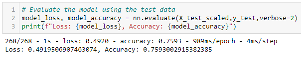

# Neural_Network_Charity_Analysis

## Overview
A dataset containing charity information of more than 34,000 organizations that received funding over the years was used to create a binary classifier that is capable of predicting whether applicants will be successful if funded by the company, Alphabet Soup.

Using Pandas and Scikit-Learn’s StandardScaler(), the dataset was preprocessed in order to compile, train, and evaluate the neural network model.

Using TensorFlow, a neural network or deep learning model was designed to create a binary classification model that can predict if an Alphabet Soup-funded organization will be successful based on the features in the dataset. The binary classification model was compiled, trained, and evaluated to calculate the model’s loss and accuracy.

Using TensorFlow, the binary classification model was optimized using various methods to achieve a target predictive accuracy higher than 75%. 

## Results
### Data Preprocessing
- The target variable is the "IS_SUCCESSFUL" column.
- All other columns were used as the features variables.
- All columns or variables were used as either a target or feature. No columns or variables were dropped in the optimized model. In the original model, "EIN" and "NAME" were dropped. 

### Compiling, Training, and Evaluating the Model

Two hidden layers were used, both with 200 neurons each. The "ReLU" activation function was used for both hidden layers. The "sigmoid" activation function was used for the output layer. Trial and error was used to determine the number of hidden layers, neurons, and activation function. Through trial and error, up to ten hidden layers were created; however, this resulted in overfitting of the model. To prevent this, a smaller number of hidden layers were utilized, while the number of neurons increased. With trial and error, up to 500 neurons per hidden layer was tested. However, this resulted in overfitting of the model. 200 neurons per layer seemed to produce the best accuracy. ReLU, sigmoid, and tanh were tested for the activation function since they are recommended for a classification model. ReLU seemed to produce the best results. The sigmoid function is good to use for the output layer since it narrows it down between 0 and 1. 

The optimized model achieved the target model performance of greater than 75%. 

Multiple methods were attempted to increase model performance:
- No columns were dropped since deep learning models are capable of handling “noisy” data, to an extent. 
- The “NAME” features column was binned. All value counts less than 100 was placed in an “Other” bin. 
- The binning methods for the application type and classification type was reduced to 100. In other words, all value counts less than 100 was placed in an “Other” bin. 
- The number of neurons per hidden layer was increased to 200 neurons per hidden layer. 
- The number of epochs was decreased to 20. 

## Summary
Given a dataset containing charity information, the original deep learning model achieved an accuracy score of less than 75%. Several methods (such as binning, adjusting the number of hidden layers, neurons, and epochs) were used to attempt to optimize the deep learning model. After optimizing the deep learning model, an accuracy score of greater than 75% was achieved. Additionally, the model loss improved - from approximately 0.55 in the original model to less than 0.50 in the optimized model. 

### Other recommended model:
Support vector machines (SVMs) are supervised learning models that analyze data used for regression and classification. SVMs could be used to solve the classification problem if a different model is required. Unlike neural network and deep learning models, SVMs are less prone to overfitting because they are trying to maximize the distance, rather than encompass all data within a boundary. Trial and error was used frequently in determining the number of hidden layers, neurons, and epochs since these three factors can cause the model to overfit. Additionally, if time was a factor, the amount of code required to build and train the SVM is notably less than the comparable deep learning model. Furthermore, in many straightforward binary classification problems, SVMs will outperform the basic neural network, and even deep learning models with ease.
